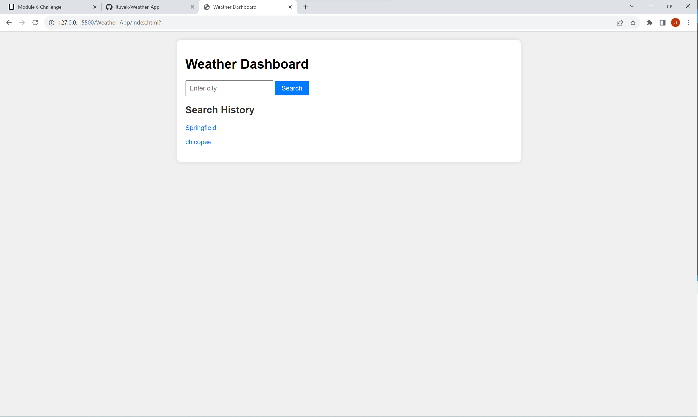

# Weather Dashboard App

## Overview

The Weather Dashboard App is a web application that allows users to check the current weather and 5-day forecast for multiple cities. It utilizes the OpenWeatherMap API to retrieve weather data.

## Features

- Search for the current weather conditions of a city.
- View a 5-day weather forecast for the searched city.
- Save search history, making it easy to check weather for previously searched cities.
- Temperature displayed in Fahrenheit for user convenience.

## Usage

1. Enter the city name in the search bar and click the "Search" button.
2. View the current weather conditions, including temperature, humidity, and wind speed.
3. Explore the 5-day forecast to plan accordingly.
4. Click on a city in the search history to see its current and future conditions.

## How to Run

1. Clone this repository to your local machine.
2. Open the `index.html` file in a web browser.

## API Key

You need to obtain an API key from OpenWeatherMap to use this application. Update the `apiKey` variable in the `script.js` file with your API key.

```javascript
const apiKey = 'YOUR_OPENWEATHERMAP_API_KEY';
```

## Technologies Used

* HTML
* CSS
* JavaScript
* OpenWeatherMap API

## Preview


